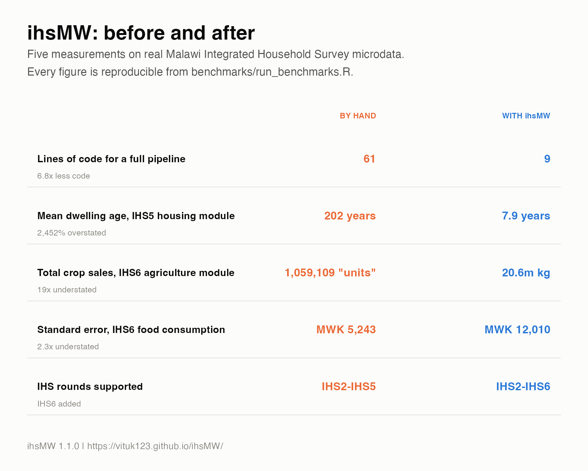
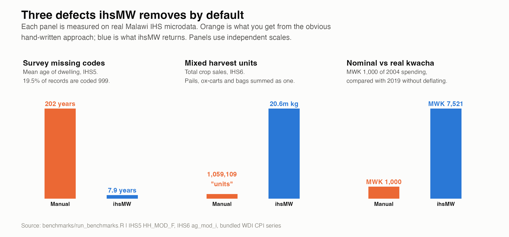
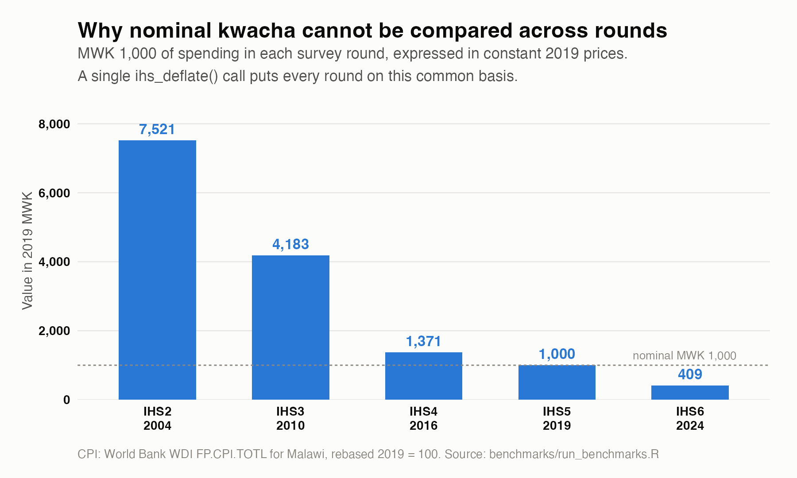
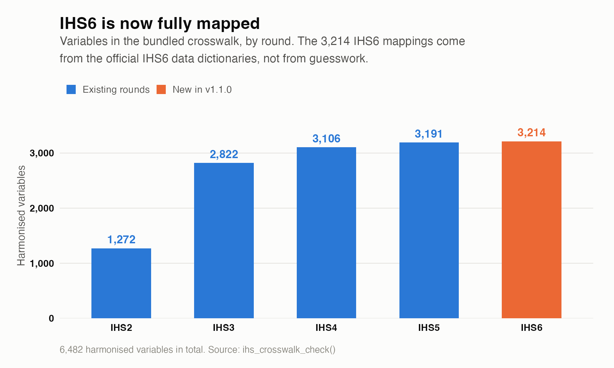

# ihsMW
<!-- badges: start -->
[](https://CRAN.R-project.org/package=ihsMW)
[](https://github.com/vituk123/ihsMW/actions/workflows/R-CMD-check.yaml)
[](https://lifecycle.r-lib.org/articles/stages.html#experimental)
[](https://opensource.org/licenses/MIT)
<!-- badges: end -->

The `ihsMW` package provides a robust, offline suite of tools to clean, aggregate, and harmonise data from the Malawi Integrated Household Survey (IHS) series. It is designed for development economists and data scientists, replacing hundreds of lines of brittle, project-specific data wrangling scripts with a single, citable, and defensible pipeline.

**Supported rounds:** IHS2 (2004/05), IHS3 (2010/11), IHS4 (2016/17), IHS5 (2019/20) and IHS6 (2024/25).

*Note: Due to World Bank data access restrictions, raw microdata files cannot be distributed inside R packages. You must manually download the required `.dta` or `.csv` files from the [World Bank Microdata Library](https://microdata.worldbank.org).*

## 📖 Documentation

The full **ihsMW User Guide** is a standalone manual covering installation, every exported function, complete end-to-end workflows, common mistakes, troubleshooting and FAQs. Read it whichever way suits you:

| Format | Link | Best for |
|---|---|---|
| 🌐 **Read online** | [ihsMW User Guide](https://vituk123.github.io/ihsMW/articles/ihsMW-user-guide.html) | Browsing, searching, copy-pasting code |
| 📄 **Download PDF** | [ihsMW-user-guide.pdf](https://vituk123.github.io/ihsMW/ihsMW-user-guide.pdf) | Printing, offline reading, sharing with colleagues |
| 📝 **Download source** | [ihsMW-user-guide.Rmd](https://vituk123.github.io/ihsMW/ihsMW-user-guide.Rmd) | Re-running every example yourself, adapting it for teaching |

Shorter topic guides: [Getting started](https://vituk123.github.io/ihsMW/articles/getting-started.html) · [Cross-round harmonisation](https://vituk123.github.io/ihsMW/articles/harmonisation.html) · [Survey weights](https://vituk123.github.io/ihsMW/articles/survey-weights.html) · [Function reference](https://vituk123.github.io/ihsMW/reference/)

## Installation

```r
# Install from CRAN
install.packages("ihsMW")

# Or install the development version from GitHub
# install.packages("pak")
pak::pak("vituk123/ihsMW")
```

## Quick start

Here is a complete end-to-end example showing how to load, harmonise, clean, deflate, design, and report on IHS data:

```r
library(ihsMW)
library(haven)

# 1. Load raw data files (downloaded manually from World Bank)
raw_demog <- read_dta("path/to/IHS6/hh_mod_a_filt.dta")
raw_cons  <- read_dta("path/to/IHS6/ihs6_consumptionaggregates.dta")

# 2. Harmonise column names automatically to the cross-round standard
#    (also adds an `ihs_round` column used later by ihs_deflate)
demog_harm <- ihs_harmonise(raw_demog, round = "IHS6")
cons_harm  <- ihs_harmonise(raw_cons,  round = "IHS6")

# 3. Merge modules (automatically detects join keys).
#    Columns present in both inputs are suffixed .x/.y - ihs_merge() warns
#    when that happens, so drop the duplicates you do not need first.
dupes <- c("region", "district", "hhsize", "hh_wgt", "ihs_round")
merged_df <- ihs_merge(
  demog_harm,
  cons_harm[, setdiff(names(cons_harm), dupes)]
)

# 4. Recode survey missing codes to NA and winsorize extreme outliers.
#    Winsorized values go to a new `_w` column; the raw column is preserved.
clean_df <- ihs_clean(
  merged_df,
  winsorize_vars = "rexp_cat011",
  winsorize_by   = "region"
)

# 5. Deflate nominal values to 2019 real prices
real_df <- ihs_deflate(clean_df, value_cols = "rexp_cat011_w")

# 6. Create survey design object (automatically detects weights, strata, PSU)
design <- ihs_svydesign(real_df)

# 7. Generate a publication-ready summary statistics table
report_tbl <- ihs_report(
  data    = real_df,
  vars    = c("hhsize", "rexp_cat011_w_real"),
  by      = "region",
  weights = "hh_wgt"
)
print(report_tbl)
```

## Function Overview

| Function | Category | Description |
|---|---|---|
| `ihs_harmonise()` | Harmonisation | Rename raw columns to harmonised names using the crosswalk. |
| `ihs_search()` | Discovery | Search variable names and labels across rounds. |
| `ihs_crosswalk_check()` | Quality Check | Assess cross-round variable comparability and review flags. |
| `ihs_panel_ids()` | Helper | Get standard household/individual ID columns for any IHS round. |
| `ihs_merge()` | Merging | Merge multiple harmonised dataframes with auto-detected keys. |
| `ihs_deflate()` | Deflation | CPI-based deflation to 2019 prices for real cross-round comparison. |
| `ihs_svydesign()` | Analysis | Set up a survey design object with auto-detected weights/strata/PSU. |
| `ihs_report()` | Analysis | Generate publication-ready weighted summary statistics tables. |
| `ihs_clean()` | Cleaning | Master cleaning wrapper (missing values & winsorization). |
| `ihs_standardize_missing()`| Cleaning | Convert survey missing codes (-99, -98, etc.) to NA. |
| `ihs_winsorize()` | Cleaning | Stratified winsorization with `_w` suffix columns. |
| `ihs_convert_units()` | Agriculture | Crop-specific unit-to-kg conversion using NSO factors. |
| `ihs_aggregate()` | Aggregation | Type-aware aggregation to the household level. |

## Why use it — measured, not claimed



Every figure below is measured on real Malawi IHS microdata by
[`benchmarks/run_benchmarks.R`](https://github.com/vituk123/ihsMW/blob/main/benchmarks/run_benchmarks.R), and the scripts
being compared are embedded in it so the comparison can be audited.

| | By hand | With `ihsMW` | |
|---|---:|---:|---|
| Lines of code for a full pipeline | 61 | **9** | 6.8× less |
| Distinct function calls to get right | 56 | **11** | 5.1× fewer |
| Mean dwelling age, IHS5 housing module | 202 years | **7.9 years** | missing codes left in |
| Total crop sales, IHS6 agriculture module | 1,059,109 "units" | **20.6m kg** | 19× understated |
| MWK 1,000 of 2004 spending, vs 2019 | MWK 1,000 | **MWK 7,521** | 7.5× understated |
| Standard error, IHS6 food consumption | MWK 5,243 | **MWK 12,010** | 2.3× understated |
| Unit conversion, 99,988 records | 1.51 s | **0.29 s** | 5.2× faster |

<details>
<summary>More benchmark figures</summary>





</details>

Full methodology and limitations: [`benchmarks/README.md`](https://github.com/vituk123/ihsMW/blob/main/benchmarks/README.md).

## Bundled reference data

| File | Contents |
|---|---|
| `ihs_crosswalk.csv` | 6,482 harmonised variables mapped across IHS2–IHS6 |
| `crop_conversion_factors.csv` | 1,608 official NSO crop × unit × region × condition factors |
| `mw_cpi_annual.csv` | Malawi CPI 2004–2025, World Bank WDI `FP.CPI.TOTL`, rebased 2019 = 100 |

Everything ships inside the package, so the whole pipeline runs offline.

## Citation

To cite `ihsMW` in publications, please use:

```bibtex
@Manual{ihsMW,
  title  = {ihsMW: Clean and Harmonise Malawi Integrated Household Survey Data},
  author = {Vitumbiko Kayuni},
  year   = {2026},
  note   = {R package version 1.1.1},
  url    = {https://github.com/vituk123/ihsMW},
}
```

Or run `citation("ihsMW")` in R.

When publishing research utilizing datasets harmonised or cleaned via `ihsMW`, always cite both the NSO Malawi and the World Bank LSMS. Please consult the respective round's Basic Information Document for the exact citation format.

## Contributing

We welcome additions and mappings! Please report bugs, suggest crosswalk configurations, and propose structural adjustments directly on our [GitHub Issues](https://github.com/vituk123/ihsMW/issues).

## License

MIT
